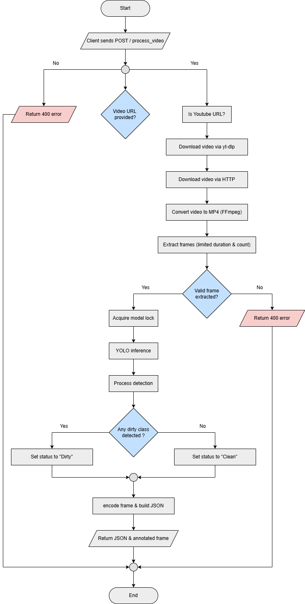

# Cleanliness-NMSAI

Cleanliness-NMSAI is a production-ready AI microservice for automated cleanliness detection from video sources. The service processes video input, performs object detection using a YOLO-based model, and determines whether an area requires cleaning.

This system is designed for controlled CPU environments and containerized deployments, with built-in safeguards to ensure stable operation under concurrent load.

---

## Overview

Cleanliness-NMSAI provides an HTTP API that:

1. Accepts a video URL (direct link).
2. Downloads and normalizes the video.
3. Extracts a limited number of frames within a defined time window.
4. Performs thread-safe YOLO inference.
5. Classifies detections into clean or dirty categories.
6. Returns structured JSON results along with an annotated image (Base64 encoded).

The service is built with FastAPI and designed for scalable backend deployment.

---

## Key Features

- Production-grade FastAPI service
- Global model loading at startup
- Thread-safe inference using locking mechanism
- CPU-protected frame extraction limits
- Support for direct video URLs and YouTube links
- Automatic video normalization via FFmpeg
- Annotated image returned as Base64
- Dockerized deployment configuration
- Headless OpenCV for server environments

---

## System Architecture


---

## Model Distribution

The production model is distributed via GitHub Release.

Version: `v1.0`  
Model File: `cleanliness-x-100.pt`

The application automatically downloads the model at startup if it is not present locally.

---

## Configuration

Core configuration parameters are defined in `app.py`:

```python
CONF_THRESHOLD = 0.29
MAX_VIDEO_SECONDS = 10
MAX_FRAMES = 10
TARGET_WIDTH = 1280
TARGET_HEIGHT = 720

DIRTY_CLASSES = {"dryleaves", "grass", "tree"}
```

These limits are intentionally defined to protect CPU resources and ensure predictable runtime behavior.

---

## API Specification

### Endpoint

POST `/process-video`

### Request Body

```json
{
  "video_url": "https://example.com/video.mp4"
}
```

### Response Example

```json
{
  "status": "Dirty",
  "message": "Area needs cleaning",
  "detections": [
    {
      "class": "dryleaves",
      "confidence": 0.91,
      "bbox": [x1, y1, x2, y2],
      "is_dirty": true
    }
  ],
  "image_base64": "..."
}
```

Response fields:

- `status`: "Dirty" or "Clean"
- `message`: Human-readable summary
- `detections`: List of detected objects
- `image_base64`: Annotated frame in Base64 format

---

## Resource Protection Strategy

To ensure safe production deployment, the system enforces:

- Maximum video processing duration
- Maximum number of processed frames
- Single-frame analysis for deterministic performance
- Thread-safe YOLO inference
- Headless OpenCV to reduce system overhead

This approach minimizes CPU spikes and improves system stability under concurrent usage.

---

## Project Structure

```
cleanliness-nmsai/
│
├── app.py
├── Dockerfile
├── docker-compose.yml
├── requirements.txt
├── .dockerignore
├── .gitignore
└── README.md
```

---

## Docker Deployment

### Build Image

```bash
docker build -t cleanliness-nmsai .
```

### Run Container

```bash
docker run -p 8004:8000 cleanliness-nmsai
```

Service will be available at:

```
http://localhost:8004/process-video
```

---

## Technology Stack

- FastAPI
- Uvicorn
- Ultralytics YOLO
- PyTorch
- OpenCV (headless)
- FFmpeg
- Docker

---

## Production Considerations

- Designed primarily for CPU-based deployments.
- Model loaded once at startup to avoid repeated memory allocation.
- Suitable for VPS or container orchestration environments.
- Can be extended to support GPU acceleration.
- Can be integrated with queue-based or asynchronous processing systems.

---

## Versioning

v1.0  
Initial production release including core inference pipeline and model distribution.

Future versions may include:

- Multi-frame decision logic
- Asynchronous processing support
- GPU optimization
- Horizontal scaling enhancements

---

## License

This project is proprietary and intended for controlled production deployment within NMSAI infrastructure.